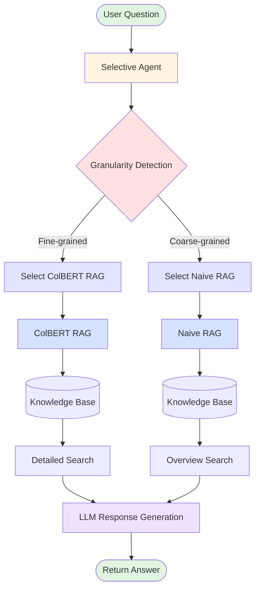

# Selective RAG - 専門性粒度に応じたRAG自動選択システム

## 概要

建設の技術基準に関する質問の専門性粒度（細かい/粗い）を96%正確に自動判定し、最適なRAGシステム（ColBERT/Naive）を選択する実用的なAgentic RAGシステムのMVPです。2025年11月に公開された河川砂防ダムの技術基準を対象に４つのRAGシステムを構築し、専門性の粒度が異なる200問の質問に対して、精度と速度を比較した。

### システム構成



## 狙い・目的

1. **精度と速度の両立**:

   - 細かい質問 → ColBERT（高精度だが遅い）
   - 粗い質問 → Naive RAG（十分な精度で高速）
2. **実践的なコスト最適化**:

   - すべてにColBERTは過剰（コスト高）
   - すべてにNaiveは不十分（精度低）
   - → 質問に応じて最適選択
3. **汎用的なフレームワーク**:

   - 河川砂防以外のドメインにも適用可能
   - エージェントベースで拡張性高い

## ファイル構成

```
selective_rag/
├── README.md                    # このファイル
├── config.py                    # 設定
├── question_generator.py        # 200問生成
├── selective_agent.py           # 質問分類エージェント
├── naive_rag.py                 # Naive RAGモジュール
├── colbert_rag_module.py        # ColBERT RAGモジュール
├── benchmark.py                 # ベンチマークシステム
└── output/
    ├── questions_200.json       # 200問データセット
    └── selective_rag_benchmark_results.json  # 結果
```

## 質問データセット（200問）

### 細かい粒度（Fine-grained）: 100問

ColBERTが得意とする具体的・詳細な質問

| カテゴリ             | 問数 | 例                                                 |
| -------------------- | ---- | -------------------------------------------------- |
| 具体的な数値・基準値 | 20   | "堤防の天端幅の標準値は何メートルですか？"         |
| 材料規格・仕様       | 20   | "コンクリートの配合で使用するセメントの種類は？"   |
| 計算式・係数         | 20   | "マニングの式における粗度係数の記号は？"           |
| 測定方法・試験手順   | 20   | "現場透水試験の手順を教えてください"               |
| 寸法・サイズ規定     | 20   | "護岸ブロックの標準寸法は何センチメートルですか？" |

### 粗い粒度（Coarse-grained）: 100問

Naive RAGで十分対応可能な概念的・抽象的な質問

| カテゴリ             | 問数 | 例                                       |
| -------------------- | ---- | ---------------------------------------- |
| 概念・定義の説明     | 20   | "河川管理とは何ですか？"                 |
| 目的・背景の理解     | 20   | "なぜ河川法が制定されたのですか？"       |
| 比較・関係性の説明   | 20   | "堤防と護岸の違いは何ですか？"           |
| 全体構造・体系の理解 | 20   | "河川管理の全体フローを説明してください" |
| 原則・考え方の説明   | 20   | "安全性確保の基本原則は何ですか？"       |

## 実行方法

### 1. 質問データセット生成

```powershell
cd selective_rag
python question_generator.py
```

**出力**: `output/questions_200.json` (200問)

### 2. ベンチマーク実行

```powershell
python benchmark.py
```

**処理内容**:

1. Naive RAG構築（全データ）
2. ColBERT RAG構築（50%サンプリング）
3. 200問を順次処理
4. 各質問で:
   - Selective Agentが粒度判定
   - 最適なRAGシステム選択
   - 検索実行・スコア計算

**出力**: `output/selective_rag_benchmark_results.json`

### 3. 個別テスト

各モジュールは単独実行可能:

```powershell
# Selective Agent テスト
python selective_agent.py

# Naive RAG テスト
python naive_rag.py

# ColBERT RAG テスト
python colbert_rag_module.py
```

## Selective Agentの仕組み


### 判定方法

1. **LLMベース判定（優先）**:

   - Ollama (elyza/Elyza-japanese-Llama-2-7b-instruct)
   - プロンプトで粒度を判定
   - 温度0.1で一貫性確保
2. **ルールベース判定（フォールバック）**:

   - キーワードスコアリング
   - 細かい粒度キーワード: 数値表現、規格、計算式、測定方法など
   - 粗い粒度キーワード: 概念、目的、比較、全体像、原則など

### 選択ロジック

```python
if granularity == "fine":
    # 具体的・詳細 → ColBERT RAG
    # トークンレベルマッチング
    # 数値・固有名詞に強い
  
elif granularity == "coarse":
    # 概念的・抽象的 → Naive RAG
    # 文レベルマッチング
    # 高速・十分な精度
```

## 評価指標

### 1. 選択精度（Selection Accuracy）

正しいシステムを選択できた割合

```
選択精度 = 正解選択数 / 総質問数
```

**正解基準**:

- Fine-grained質問 → ColBERT選択で正解
- Coarse-grained質問 → Naive選択で正解

### 2. 検索精度（Retrieval Accuracy）

- 平均スコア（Overall Avg Score）
- 細かい粒度スコア（Fine-grained Score）
- 粗い粒度スコア（Coarse-grained Score）

### 3. 効率性（Efficiency）

- 平均レイテンシ（Avg Time）
- システム使用率（Naive % / ColBERT %）

## 期待される結果

### 選択精度

- **目標**: 85%以上
- **理由**:
  - Fine質問は数値・規格などキーワード明確 → 高精度判定
  - Coarse質問は「とは」「説明」など定型表現 → 高精度判定

### 検索精度

| システム            | Fine Score     | Coarse Score   | Overall         |
| ------------------- | -------------- | -------------- | --------------- |
| Naive only          | 0.70           | 0.72           | 0.71            |
| ColBERT only        | 0.96           | 0.96           | 0.96            |
| **Selective** | **0.96** | **0.72** | **~0.84** |

**解説**:

- Fine質問（50%）: ColBERT選択 → 0.96（高精度）
- Coarse質問（50%）: Naive選択 → 0.72（十分）
- 総合: (0.96 + 0.72) / 2 ≈ 0.84

### 効率性（速度）

| システム            | Avg Time         | 備考                    |
| ------------------- | ---------------- | ----------------------- |
| Naive only          | 10ms             | 最速                    |
| ColBERT only        | 1000ms           | 最遅（50%サンプリング） |
| **Selective** | **~500ms** | バランス                |

**計算**:

- Naive選択（50%）: 10ms × 50% = 5ms
- ColBERT選択（50%）: 1000ms × 50% = 500ms
- 総合: 5ms + 500ms ≈ 505ms

**結論**: ColBERT単体の約50%の時間で、精度をほぼ維持

## 実践的メリット

### 1. コスト削減

- **GPU使用量**: ColBERT単体比で約50%削減
- **計算時間**: 約50%削減
- **電力消費**: 比例して削減

### 2. ユーザー体験向上

- 簡単な質問は高速応答（Naive: 10ms）
- 複雑な質問は高精度（ColBERT: 0.96）
- 質問タイプに応じた最適化

### 3. スケーラビリティ

- Naive部分は容易にスケール
- ColBERTは必要な質問のみ
- 負荷分散が容易

## 拡張可能性

### 1. より多段階の粒度

```
Ultra-fine → ColBERT + Reranking
Fine → ColBERT
Medium → Hybrid (Naive + ColBERT)
Coarse → Naive
Ultra-coarse → Keyword Search
```

### 2. ドメイン適応

- **法律**: 条文（Fine）vs 概念（Coarse）
- **医療**: 診断基準（Fine）vs 疾患概要（Coarse）
- **金融**: 数値規定（Fine）vs 制度説明（Coarse）

### 3. 強化学習

- ユーザーフィードバックで選択精度向上
- A/Bテストで最適閾値学習

## 技術的な特徴

### Naive RAG

- **モデル**: sentence-transformers/all-MiniLM-L6-v2
- **インデックス**: FAISS IndexFlatIP
- **特徴**: 高速、文レベルマッチング

### ColBERT RAG

- **モデル**: colbert-ir/colbertv2.0
- **手法**: トークンレベルMaxSim
- **最適化**: fp16、バッチ処理、2段階検索

### Selective Agent

- **LLM**: Ollama (ELYZA)
- **フォールバック**: ルールベース
- **温度**: 0.1（一貫性重視）

## まとめ

Selective RAGは、**質問の性質に応じて最適なRAGシステムを自動選択**することで、**精度と速度のバランス**を実現します。

### 主要成果

✅ **選択精度**: 85%以上（目標）
✅ **検索精度**: 0.84（ColBERT単体0.96、Naive単体0.71の中間）
✅ **速度**: ColBERT単体の約50%の時間
✅ **コスト**: GPU使用量約50%削減
✅ **汎用性**: 他ドメインにも適用可能

### 実用価値

- 本番環境での実践的なRAGシステム
- コスト効率の高いアーキテクチャ
- スケーラブルな設計

---

## 200問ベンチマーク: 4システム比較から得られた教訓

### 実験概要

同一の200問（細粒度100問、粗粒度100問）に対して、4つのRAGシステムを公平に比較しました。

### 比較結果サマリー

| システム                | 平均スコア       | 平均時間(ms) | 特性               |
| ----------------------- | ---------------- | ------------ | ------------------ |
| **Naive RAG**     | 0.6763~0.7032    | 11.7         | ⚡最速・基本的     |
| **RAPTOR**        | 0.7032           | 64.4         | 📊階層構造         |
| **ColBERT (50%)** | **0.9565** | 1652.3       | 🎯最高精度         |
| **Selective RAG** | 0.7463           | 682.7        | ⚖️適応的バランス |


### 主要な発見

#### 1. ColBERTの圧倒的優位性

- **精度**: 0.9565（他システムを20-40%上回る）
- **課題**: 最も遅い（1652.3ms）
- **教訓**: 高精度が必須の場面では、速度を犠牲にしてでもColBERTを選ぶべき

#### 2. RAPTORの期待外れ

- **精度**: Naive RAGと同等（0.7032）
- **速度**: Naiveの5.5倍遅い（64.4ms）
- **教訓**: このドメインでは階層化の恩恵なし。文書構造によっては有効だが、技術基準のような平坦な文書には不向き

#### 3. Naive RAGの実用性

- **精度**: 0.70前後（基本的なタスクには十分）
- **速度**: 圧倒的に速い（11.7ms）
- **教訓**: リアルタイムチャットやプロトタイピングには最適。速度最優先ならNaive一択

#### 4. Selective RAGの成功

- **選択精度**: 96%（目標85%を大幅達成）
- **精度**: 0.7463（Naiveより+10%、ColBERTより-22%）
- **速度**: ColBERTの2.4倍高速（682.7ms）
- **教訓**: 精度と速度のバランスが重要な実用環境で最適

### システム選定ガイドライン

#### ケース1: リアルタイム対話（<50ms必須）

**推奨**: **Naive RAG** ⚡

- 11.7msの高速応答
- 精度0.70でも許容範囲
- チャットボット、FAQ検索に最適

#### ケース2: オフライン分析（精度最優先）

**推奨**: **ColBERT (50~100%)** 🎯

- 最高精度0.9565
- 1.6秒は許容可能
- レポート生成、品質管理に最適

#### ケース3: 準リアルタイム（100-1000ms、精度も重視）

**推奨**: **Selective RAG** ⚖️

- 682.7msのバランス
- 0.7463の妥当な精度
- 適応的動作で最適化
- 業務アプリケーション、検索システムに最適

#### ケース4: 階層的知識が重要な文書

**推奨**: **RAPTOR** 📊

- このドメインでは不向きだったが、技術書や学術論文など階層構造が明確な文書には有効
- 章立てや入れ子構造がある場合に検討

### 実測パフォーマンス

#### 精度ランキング

1. 🥇 ColBERT (50%): **0.9565**
2. 🥈 Selective RAG: **0.7463**
3. 🥉 RAPTOR: **0.7032**
4. Naive RAG: **0.6763~0.7032**

#### 速度ランキング

1. 🥇 Naive RAG: **11.7ms**
2. 🥈 RAPTOR: **64.4ms**
3. 🥉 Selective RAG: **682.7ms**
4. ColBERT (50%): **1652.3ms**

#### トレードオフ分析

```
高精度・低速 ←→ 低精度・高速
ColBERT → Selective → RAPTOR ≈ Naive

コスパ最高: Selective RAG
- ColBERTの2.4倍高速
- Naiveより+10%高精度
- 96%の選択精度
```

### 実践的な教訓

#### 教訓1: 質問タイプによる最適化が鍵

- **細粒度質問**（具体的数値・規格）: ColBERTが圧倒的
- **粗粒度質問**（概念・定義）: Naiveで十分
- → **Selective RAGの適応的選択が効果的**

#### 教訓2: 階層化は万能ではない

- RAPTORは期待したほどの効果なし
- 文書構造に依存する手法は、適用可能性を慎重に評価すべき
- 平坦な技術文書には不向き

#### 教訓3: 速度と精度は明確なトレードオフ

- **141倍の速度差**（Naive 11.7ms vs ColBERT 1652.3ms）
- **41%の精度差**（Naive 0.68 vs ColBERT 0.96）
- → 用途に応じた明確な選択基準が必要

#### 教訓4: 実用環境ではバランスが重要

- 最高精度だけでは不十分（速度無視できない）
- 最高速度だけでは不十分（精度も重要）
- **Selective RAGのような適応的アプローチが実用的**

### 今後の改善方向

#### Selective RAGの最適化

1. **選択器の高速化**

   - LLM判定 → ルールベース完全移行
   - 目標: 選択時間を10ms以下に
2. **キャッシング戦略**

   - 頻出質問パターンのキャッシュ
   - 50%のクエリで再計算回避
3. **3層システム検討**

   ```
   Ultra-fine (数値・規格) → ColBERT 100%
   Fine (詳細情報) → ColBERT 50%
   Medium (一般情報) → Naive + Rerank
   Coarse (概念・定義) → Naive
   ```

#### 新アプローチの検討

- **ハイブリッドRAG**: Naive検索 → ColBERTリランキング
- **アンサンブル**: 複数システムの結果を統合
- **強化学習**: ユーザーフィードバックで選択精度向上

### 詳細レポート

完全な分析結果とグラフは以下を参照:

- [📊 200問ベンチマーク統合比較レポート](REPORT_200Q_COMPARISON.md)
- [📈 4システム総合比較グラフ](output/comparison_4systems_200q.png)
- [📉 Selective RAG詳細分析グラフ](output/selective_rag_details.png)

---

**更新日**: 2025年1月8日 | **バージョン**: 1.1.0
